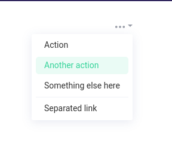
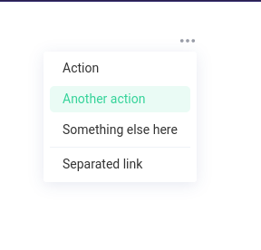
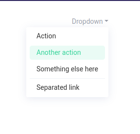
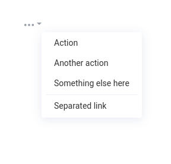
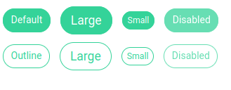
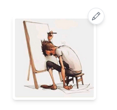
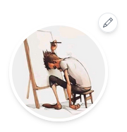
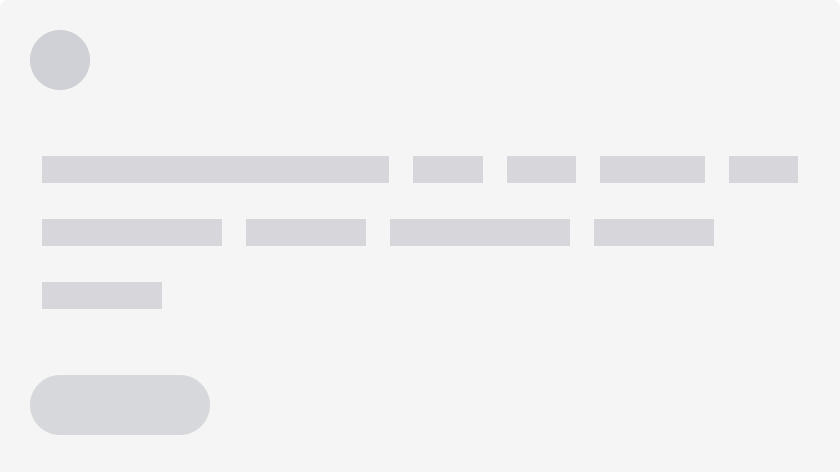

# Social media app

## Routes

### No Authentication

| Page    | Path            | Component                               |
| ------- | --------------- | --------------------------------------- |
| 404     | `*`             | [`404`](src/pages/noAuth/404.jsx)       |
| Sign In | `/auth/sign-in` | [`SignIn`](src/pages/noAuth/SignIn.jsx) |
| Sign Up | `/auth/sign-up` | [`SignUp`](src/pages/noAuth/SignUp.jsx) |

### Need Authentication

| Page           | Path                      | Component                                               |
| -------------- | ------------------------- | ------------------------------------------------------- |
| Homepage       | `/`                       | [`Homepage`](src/pages/noAuth/Homepage.jsx)             |
| Update Profile | `/setting/update-profile` | [`UpdateProfile`](src/pages/needAuth/UpdateProfile.jsx) |
| Update User    | `/setting/update-user`    | [`UpdateUser`](src/pages/needAuth/UpdateUser.jsx)       |
| Profile        | `/profile/profileId`      | [`Profile`](src/pages/needAuth/Profile.jsx)             |

## Components

### Dropdown

#### Props

| Props       | Type                   | Default                                                                                                                                   | Description                                                   |
| ----------- | ---------------------- | ----------------------------------------------------------------------------------------------------------------------------------------- | ------------------------------------------------------------- |
| `noArrow`   | `Boolean`              | `false`                                                                                                                                   | hide dropdown arrow                                           |
| `toLeft`    | `Boolean`              | `false`                                                                                                                                   | change direction from left to right                           |
| `isOpen`    | `Boolean`              | `false`                                                                                                                                   | change init state for showing dropdown                        |
| `label`     | `String` `JSX.Element` | `<BsThreeDots />`                                                                                                                         | change displayed text (can be text or icon from `react-icon`) |
| `className` | `String`               | `''`                                                                                                                                      | add class to dropdown wrapper                                 |
| `children`  | `JSX.Element`          | [`L86-L110`](https://github.com/tahaebaed/link-social/blob/1a08f394df55db26b3a90c780e130a1adc462e51/src/components/Dropdown.jsx#L86-L110) | add custom children                                           |

#### Examples

Default Usage `<Dropdown />`



No Arrow `<Dropdown noArrow />`



Change Label `<Dropdown label='Dropdown' />` or `<Dropdown label={<TbGridDots />} />`



To Left Direction `<Dropdown toLeft />`



#### Playground

```jsx
import Dropdown from './components/Dropdown';

<Dropdown />
<Dropdown noArrow />
<Dropdown label='Dropdown' />
<Dropdown label={<TbGridDots />} />
<Dropdown isOpen={true} />
<Dropdown noArrow toLeft />

// add custom children
<Dropdown >
  ...
</Dropdown>
```

#### Using builtin structure

The following example shows the default value for dropdown, make sure you use it in the right way.

```html
<ul>
  <li>
    <a className="dropdown-item" href="#"> Action </a>
  </li>
  <li>
    <a className="dropdown-item" href="#"> Another action </a>
  </li>
  <li>
    <a className="dropdown-item" href="#"> Something else here </a>
  </li>
  <li>
    <hr className="dropdown-divider" />
  </li>
  <li>
    <a className="dropdown-item" href="#"> Separated link </a>
  </li>
</ul>
```

### Button

#### Usage

| Props       | Type      | Default  | Description              |
| ----------- | --------- | -------- | ------------------------ |
| `outline`   | `Boolean` | `false`  | create outline buttons   |
| `sm`        | `Boolean` | `false`  | create small buttons     |
| `lg`        | `Boolean` | `false`  | create bigger buttons    |
| `as`        | `String`  | `button` | change button tag        |
| `disabled`  | `Boolean` | `false`  | disabled buttons actions |
| `className` | `String`  | `''`     | add class to button      |

#### Examples

Default Usage `<Button />`



#### Playground

```jsx
import Button from './components/Button';

<Button />
<Button lg />
<Button sm />
<Button disabled />
<Button as='a' href='#taps'> taps </Button>

// Outline
<Button outline />
<Button outline lg />
<Button outline sm />
<Button outline disabled />
```

### Preview

#### Props

| Props       | Type      | Default                                                                                                                                        | Description                               |
| ----------- | --------- | ---------------------------------------------------------------------------------------------------------------------------------------------- | ----------------------------------------- |
| `img`       | `String`  | [`Avatar`](https://res.cloudinary.com/mohammed-taysser/image/upload/h_500,w_500/v1654621448/paperCuts/authors/avatar/mu931hsdzu68wwqpumbh.jpg) | set initial image                         |
| `id`        | `String`  | `preview-id`                                                                                                                                   | set input id                              |
| `name`      | `String`  | `preview-`                                                                                                                                     | set input name                            |
| `label`     | `String`  | `Change Preview`                                                                                                                               | set input label                           |
| `onChange`  | `String`  | `() => {}`                                                                                                                                     | onChange function with file, event params |
| `circle`    | `Boolean` | `false`                                                                                                                                        | change wrapper to circle                  |
| `icon`      | `String`  | `<BsPencil />`                                                                                                                                 | change label icon                         |
| `className` | `String`  | `''`                                                                                                                                           | add any additional className              |

#### Examples

Default Usage `<Preview />`



Default Usage `<Preview circle />`



#### Playground

```jsx
import Preview from './components/Preview';

<Preview onChange={file=>console.log(file)} />
// to hide popover set label to null
<Preview onChange={file=>console.log(file)} label='' />
```

#### How to change preview picker

```jsx
// 1. first pass noLabel props to disable default picker
// 2. then change the id to what you want
// 3. the custom picker must be wrap on label tag
// 4. pass the same id to Preview component
<label htmlFor='custom-picker-id' >Open Preview</label> 
<Preview noLabel id='custom-picker-id' />

```

### Banner

#### Props

| Props       | Type     | Default                                                       | Description                    |
| ----------- | -------- | ------------------------------------------------------------- | ------------------------------ |
| `cover`     | `String` | [`cover`](src/assets/images/background/banner-cover.webp)     | change Banner background image |
| `overlay`   | `String` | [`overlay`](src/assets/images/background/banner-overlay.webp) | change overlay image           |
| `title`     | `String` | `''`                                                          | add Banner title               |
| `subtitle`  | `String` | `''`                                                          | add Banner subtitle            |
| `className` | `String` | `''`                                                          | add class to Banner wrapper    |

#### Usage

```jsx
import Banner from './components/Banner';

<Banner title='Profile' subtitle='Welcome to your account dashboard!' />;
```

### LoadingPlaceholder

you can change the number of your blocks by adding a new object to the the array and passing it by props

#### Usage

| Props       | Type      | Default | Description          |
| ----------- | --------- | ------- | -------------------- |
| `sm`        | `Boolean` | `false` | create small blocks  |
| `lg`        | `Boolean` | `false` | create bigger blocks |
| `className` | `String`  | `''`    | add class to block   |

#### Examples

Default Usage `<LoadingPlaceholder />`



#### Playground

```jsx
import LoadingPlaceholder from './components/placeholder/LoadingPlaceholder';


<LoadingPlaceholder />
<LoadingPlaceholder
  blocksSizes = {[
      { className: 'w-[400px]' },
      { sm: true },
      { sm: true },
    ]
    }
  />
<LoadingPlaceholder
blocksSizes = {[
    { sm: true },
    { sm: true },
    { lg: true },
    { lg: true },
  ]
  }
/>
```

### PostCard

#### Usage

| Props             | Type     | Default | Description                            |
| ----------------- | -------- | ------- | -------------------------------------- |
| `profileImg`      | `String` | `''`    | profile image of post creator          |
| `userName`        | `String` | `''`    | username of post creator               |
| `postTime`        | `String` | `''`    | when post were created                 |
| `postDescription` | `String` | `''`    | post content                           |
| `likesCount`      | `String` | `''`    | count people who liked the post        |
| `commentsCount`   | `String` | `''`    | count people who commented on the post |
| `shareCount`      | `String` | `''`    | count people who shared the post       |

#### Playground

```jsx
import PostCard from './post/components/PostCard';
import profileImg from from '../assets/images/imgs/profilePic.png';

<PostCard
  Img={profileImg}
  userName='James Spiegel'
  postTime='19 hours ago'
  description="Duis aute irure dolor in reprehenderit in voluptate velit essecillum dolore eu fugiat nulla pariatur. Excepteur sint occaecat cupidatat non proident, sunt in culpa qui officia deserunt mollit anim id est laborum. Sed ut perspiciatis unde omnis iste natus error sit voluptatem accusantium doloremque"
  likesCount='8'
  commentsCount='17'
  shareCount='14'
/>
```

#### Playground result


### ProfileImg

#### Usage

| Props       | Type      | Default      | Description         |
| ----------- | --------- | ------------ | ------------------- |
| `border`    | `Boolean` | `false`      | add border to image |
| `className` | `String`  | `''`         | add class to image  |
| `img`       | `String`  | `'user img'` | img url             |

#### Example

```jsx
import ProfileImg from './ProfileImg';
<ProfileImg />
<ProfileImg border img='url' />
<ProfileImg border >
```

## Layout

### Navbar

Consists of the following component:

1. [`Friends Dropdown`](src/layout/navbar/FriendsDropdown.jsx)
2. [`Messages Dropdown`](src/layout/navbar/MessageDropdown.jsx)
3. [`Notification Dropdown`](src/layout/navbar/NotificationDropdown.jsx)
4. [`User Dropdown`](src/layout/navbar/UserDropdown.jsx)
5. [`Query Search`](src/layout/navbar/QuerySearch.jsx)
6. [`Mobile Menu Dropdown`](src/layout/navbar/MobileMenu.jsx) (show only on mobile)

all of them depend on the [`NavbarDropdown`](src/layout/navbar/NavbarDropdown.jsx) component

#### Props

| Props       | Type                     | Default | Description                                                                            |
| ----------- | ------------------------ | ------- | -------------------------------------------------------------------------------------- |
| `label`     | `String` `React.Element` | `label` | change dropdown toggle label                                                           |
| `count`     | `Number`                 | `''`    | add notification counter                                                               |
| `pageUrl`   | `String`                 | `''`    | specify href for it's page                                                             |
| `pageLabel` | `String`                 | `''`    | change displayed text (can be text or icon from `react-icon`)                          |
| `type`      | `String`                 | `''`    | change button & toggle counter color, can be one of `friends, messages, notifications` |

#### Example

```jsx
<NavbarDropdown label={<MdOutlineEmojiEmotions />} count={21}>
  // ...
</NavbarDropdown>

// with page button (messages dropdown)
<NavbarDropdown
  label={<HiOutlineChatBubbleLeftRight />}
  count={61}
  pageUrl='/messages'
  pageLabel='View All Messages'
  type='messages'
>
  // ...
</NavbarDropdown>
```

## Hooks

### `usePageTitle`

#### props

| Props | Type     | Default                    |
| ----- | -------- | -------------------------- |
| Title | `String` | The title for current page |

Hook for change page title

#### Example

```jsx
import usePageTitle from '../hooks/usePageTitle';

usePageTitle('Homepage'); // title will be 'Link | Homepage'

// Can use emoji
usePageTitle('Update Profile 🎉'); // title will be 'Link | Update Profile 🎉'
```

## Resources

- [`Github Repository`](https://github.com/tahaebaed/link-social)
- [`Theme 1`](https://html.crumina.net/html-olympus/02-ProfilePage.html?)
- [`Theme 2`](http://sociala.uitheme.net/home)
- [`Trello Dashboard`](https://trello.com/b/Jqjk9udQ/simple-project-board)
- [`API Endpoint`](https://link-social.up.railway.app/api/v1)
- [`API Docs`](https://salehgoied.github.io/link-social/public/docs/#)
- [`Tailwind Components`](https://tailwind-elements.com/docs/)
