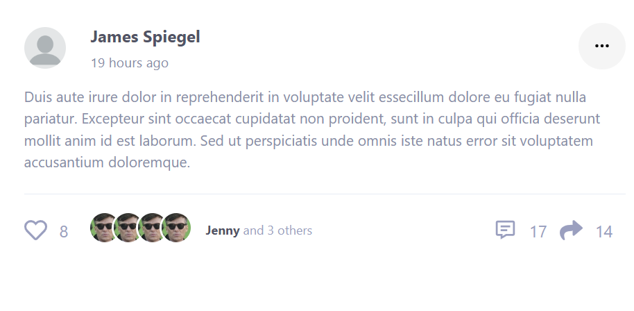

# Social media app

## Components

### Dropdown

#### Usage

| Props       | Type                   | Default           | Description                                                   |
| ----------- | ---------------------- | ----------------- | ------------------------------------------------------------- |
| `noArrow`   | `Boolean`              | `false`           | hide dropdown arrow                                           |
| `toLeft`    | `Boolean`              | `false`           | change direction from left to right                           |
| `isOpen`    | `Boolean`              | `false`           | change init state for showing dropdown                        |
| `label`     | `String` `JSX.Element` | `<BsThreeDots />` | change displayed text (can be text or icon from `react-icon`) |
| `className` | `String`               | `''`              | add class to dropdown wrapper                                 |

#### Examples

Default Usage `<Dropdown />`


No Arrow `<Dropdown noArrow />`


Change Label `<Dropdown label='Dropdown' />` or `<Dropdown label={<TbGridDots />} />`


To Left Direction `<Dropdown toLeft />`


#### Playground

```jsx
import Dropdown from './components/Dropdown';

<Dropdown />
<Dropdown noArrow />
<Dropdown label='Dropdown' />
<Dropdown label={<TbGridDots />} />
<Dropdown isOpen={true} />
<Dropdown noArrow toLeft />

// add custom children
<Dropdown >
  ...
</Dropdown>
```

### Button

#### Usage

| Props       | Type      | Default | Description              |
| ----------- | --------- | ------- | ------------------------ |
| `outline`   | `Boolean` | `false` | create outline buttons   |
| `sm`        | `Boolean` | `false` | create small buttons     |
| `lg`        | `Boolean` | `false` | create bigger buttons    |
| `disabled`  | `Boolean` | `false` | disabled buttons actions |
| `className` | `String`  | `''`    | add class to button      |

#### Examples

Default Usage `<Button />`


#### Playground

```jsx
import Button from './components/Button';

<Button />
<Button lg />
<Button sm />
<Button disabled />

// Outline
<Button outline />
<Button outline lg />
<Button outline sm />
<Button outline disabled />
```

## Layout

### Navbar

Consists of the following component:

1. [`Friends Dropdown`](src/layout/navbar/FriendsDropdown.jsx)
2. [`Messages Dropdown`](src/layout/navbar/MessageDropdown.jsx)
3. [`Notification Dropdown`](src/layout/navbar/NotificationDropdown.jsx)
4. [`User Dropdown`](src/layout/navbar/UserDropdown.jsx)
5. [`Query Search`](src/layout/navbar/QuerySearch.jsx)
6. [`Mobile Menu Dropdown`](src/layout/navbar/MobileMenu.jsx) (show only on mobile)

all of them depend on the [`NavbarDropdown`](src/layout/navbar/NavbarDropdown.jsx) component

#### Props

| Props       | Type                     | Default | Description                                                                            |
| ----------- | ------------------------ | ------- | -------------------------------------------------------------------------------------- |
| `label`     | `String` `React.Element` | `label` | change dropdown toggle label                                                           |
| `count`     | `Number`                 | `''`    | add notification counter                                                               |
| `pageUrl`   | `String`                 | `''`    | specify href for it's page                                                             |
| `pageLabel` | `String`                 | `''`    | change displayed text (can be text or icon from `react-icon`)                          |
| `type`      | `String`                 | `''`    | change button & toggle counter color, can be one of `friends, messages, notifications` |

#### Example

```jsx
<NavbarDropdown label={<MdOutlineEmojiEmotions />} count={21}>
  // ...
</NavbarDropdown>

// with page button (messages dropdown)
<NavbarDropdown
  label={<HiOutlineChatBubbleLeftRight />}
  count={61}
  pageUrl='/messages'
  pageLabel='View All Messages'
  type='messages'
>
  // ...
</NavbarDropdown>
```

### LoadingPlaceholder

you can change the number of your blocks by adding a new object to the the array and passing it by props

#### Usage

| Props       | Type      | Default | Description          |
| ----------- | --------- | ------- | -------------------- |
| `sm`        | `Boolean` | `false` | create small blocks  |
| `lg`        | `Boolean` | `false` | create bigger blocks |
| `className` | `String`  | `''`    | add class to block   |

#### Examples

Default Usage `<LoadingPlaceholder />`


#### Playground

```jsx
import LoadingPlaceholder from './components/placeholder/LoadingPlaceholder';


<LoadingPlaceholder />
<LoadingPlaceholder blocksSizes = [{ className: 'w-[400px]' },
		{ sm: true },
		{ sm: true },] />
<LoadingPlaceholder blocksSizes = [{ className: 'w-[400px]' },
		{ sm: true },
		{ sm: true },
		{ lg: true },
		{ lg: true },] />
```

### PostCard

#### Usage

| Props             | Type     | Default | Description                            |
| ----------------- | -------- | ------- | -------------------------------------- |
| `profileImg`      | `String` | `''`    | profile image of post creator          |
| `userName`        | `String` | `''`    | username of post creator               |
| `postTime`        | `String` | `''`    | when post were created                 |
| `postDescription` | `String` | `''`    | post content                           |
| `likesCount`      | `String` | `''`    | count people who liked the post        |
| `commentsCount`   | `String` | `''`    | count people who commented on the post |
| `shareCount`      | `String` | `''`    | count people who shared the post       |

#### Playground

```jsx
import PostCard from './components/PostCard';
import img from from '../assets/images/imgs/profilePic.png';
<PostCard
  profileImg={img}
	userName='James Spiegel'
	postTime='19 hours ago'
	postDescription="Duis aute irure dolor in reprehenderit in voluptate velit essecillum dolore eu fugiat nulla pariatur. Excepteur sint occaecat cupidatat non proident, sunt in culpa qui officia deserunt mollit anim id est laborum. Sed ut perspiciatis unde omnis iste natus error sit voluptatem accusantium doloremque"
	likesCount='8'
	commentsCount='17'
	shareCount='14'
/>;
```

#### Playground result


